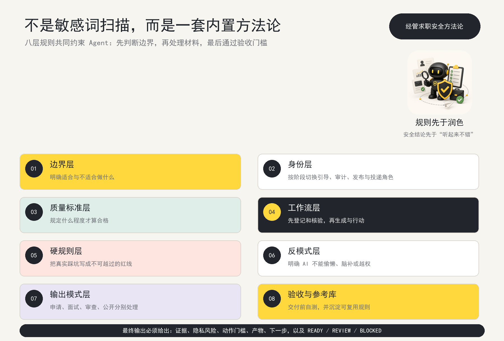
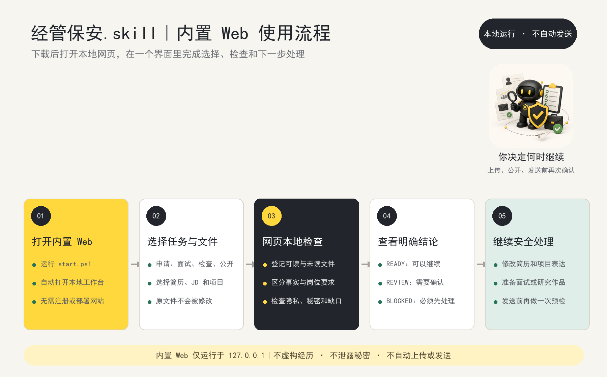

<div align="center">

# 经管保安.skill

### 经管生用 AI 找工作之前，先把不能证实、可能泄露和容易发错的内容拦下来


[](LICENSE)


**金融行研首发 · 逐步扩展咨询、商业分析、市场研究、财务审计与管培**

[内置方法论](#内置方法论) · [它能做什么](#它能做什么) · [怎么用](#怎么用) · [效果示例](#效果示例) · [安装](#安装)

</div>

---

## 为什么值得安装

经管保安不是一个只会找手机号和邮箱的正则脚本。它把经管求职中最容易出错的五段工作接成了一个可复用流程。当前先把金融行研做深，再逐步扩展到咨询、商业分析、市场研究、财务审计和管培。

### 1. 下载后直接打开本地 Web

双击 `start.cmd`，或运行 `.\start.ps1`，就能打开内置工作台。用户不需要部署云服务、注册账号、填写本机路径，也不需要先理解 Agent 配置。

### 2. 先建立证据边界，再修改简历

系统把简历事实、JD 要求、课程项目、商赛、研究资料和用户补充信息分开处理。没有来源的经历不会被润色成“已经做过”，PDF 或 DOCX 没读到正文时也会明确标记。

### 3. 自动识别面试方向，但允许用户修正

上传 JD 后，会从岗位类型、行业方向、能力重点和建议作品四个维度生成可编辑的面试方向。例如金融行研会得到：

```text
卖方研究 · 消费 / 轻工 · 行业研究与资料整理
建议作品：小型行业研究 + 3 分钟面试陈述
```

后续会覆盖咨询 Case、商业分析、品牌市场、财务审计和管培场景。方向来自岗位描述，只用于组织准备流程，不会被写成候选人经历。

### 4. 把零散资料变成可核对的小型行研框架

课程报告、商赛、项目文件、公司资料和研究笔记会进入独立的参考资料台账，保留来源与可核对片段，并生成：

```text
研究问题 -> 事实底稿 -> 核心判断 -> 驱动与风险 -> 面试表达
```

它不会把参考材料自动包装成确定性结论，而是帮助用户在面试前做出结构完整、证据可追溯的研究样本。当前内置的是小型行研框架，后续会增加咨询分析、商业分析和市场研究模板。

### 5. 把真实投递当作受控动作

公开 Skill 不保存邮箱密码或授权码。投递前应检查收件人、主题、附件、证据和隐私状态，内置 Web 还提供脱敏的 163 邮箱 SMTP 设置示意：

```text
设置 -> POP3/SMTP/IMAP -> 开启 IMAP/SMTP
-> 授权密码管理 -> 生成客户端授权码
```

授权码只能在独立发送流程中当次使用，不能进入源码、日志、浏览器存储或 Git。

---

## 内置方法论

`经管保安.skill` 的核心卖点不是一组手机号、邮箱和 Token 正则，而是一套写进 Agent 行为约束的 **八层经管求职安全方法论**。



| 方法层 | 解决什么问题 |
| --- | --- |
| **边界层** | 说清楚适合做什么、不适合做什么，避免把安全工具包装成招聘平台或自动投递器 |
| **身份层** | 让 Agent 在引导、材料登记、证据审计、脱敏、发布和投递阶段切换正确角色 |
| **质量标准层** | 明确可追溯证据、隐私清理、附件核验和动作状态达到什么程度才算合格 |
| **工作流层** | 强制按照“登记 → 查证据 → 查隐私 → 守动作 → 记录结果”推进 |
| **硬规则层** | 把虚构经历、泄露授权码、错误收件人、缺失附件等真实踩坑写成红线 |
| **反模式层** | 禁止一上来就润色、把所有命中都算泄露、掩盖证据缺口或越权执行 |
| **输出模式层** | 对申请、面试、材料审查和公开作品使用不同交付方式 |
| **验收与参考库层** | 交付前运行自测和发布扫描，并把新失败案例沉淀为规则与测试 |

这意味着同一份材料进入系统后，不只是“扫出几个风险”，而是会得到：

```text
证据：哪些事实能够使用，哪些只是推断或缺口
隐私：发现了什么风险，需要删除还是人工确认
动作门槛：当前能否公开、上传或发送
产物：检查结果、路由回执、预检记录
下一步：一个明确且安全的后续动作
结论：READY / REVIEW / BLOCKED
```

---

## 它能做什么

经管求职材料最危险的地方，往往不是“不够好看”，而是：

- 把 JD 里的要求写成自己已经做过的经历；
- 简历、邮件、课程项目、研究作品和面试话术互相打架；
- 公开仓库里混入真实邮箱、手机号、本机路径或授权码；
- 收件人、标题、附件没核对，就准备真实发送；
- PDF、DOCX 没读到正文，AI 却假装已经看过。

`经管保安.skill` 把检查放在生成、公开和发送之前：

| 阶段 | 做什么 | 产出 |
| --- | --- | --- |
| ① 收材料 | 按简历、JD、项目、附件分类保存原件 | 文件清单与路由回执 |
| ② 查证据 | 区分候选人事实、岗位要求、缺口与禁止使用内容 | 证据台账 |
| ③ 查隐私 | 检查手机号、邮箱、本机路径和疑似秘密字段 | 脱敏检查结果 |
| ④ 守动作 | 核对收件人、主题、附件、dry-run 和即时确认 | `READY / REVIEW / BLOCKED` |

它不会替你做招聘决策，也不会为了提高匹配度虚构经历。

---

## 和通用 AI 有什么不同

通用 AI 倾向于“先给一版听起来不错的答案”。经管保安先问：

1. 这句话来自简历、项目文件，还是用户刚刚确认？
2. 这是候选人事实，还是 JD 对理想候选人的要求？
3. 文件正文真的读取了吗？
4. 这份材料是私人整理、公开发布，还是准备真实发送？
5. 外部动作发生前，是否完成了当次确认？

```text
用户材料
→ 文件登记
→ 证据分类
→ 隐私检查
→ 缺口提示
→ 生成或修改材料
→ 发送前预检
→ 用户即时确认
```

---

## 怎么用



### 本地网页

下载仓库后：

```powershell
.\install.ps1
.\start.ps1
```

也可以双击 `start.cmd`。

启动脚本会打开项目内置的本地 Web 工作台，不需要部署服务器、注册账号或填写文件路径。用户在网页中选择任务、上传本机文件、查看检查结果，再决定是否继续修改、公开或发送。

除文件选择外，也支持直接粘贴简历、JD、研究笔记和其他文字材料。粘贴内容与上传文件经过同一套证据和隐私检查。

网页会引导你选择：

- **申请一个岗位**：简历 + JD + 可选项目材料；
- **准备一场面试**：简历 + 可选 JD 和笔记；
- **检查求职材料**：批量检查现有文件；
- **整理公开作品**：按公开发布标准检查项目和报告。

文件只交给 `127.0.0.1` 上的本地服务。页面不会自动上传或发送。

### 在 Agent 中调用

为兼容已经安装的用户，当前 Skill 调用 ID 暂时保留为 `$finance-security-guard`；展示品牌和 GitHub 仓库已升级为“经管保安”。

```text
这是我的简历、目标 JD 和项目材料。
请使用 $finance-security-guard 先检查证据和隐私，
再告诉我哪些内容可以用于投递，哪些必须补充或删除。
```

### 命令行

```powershell
# 隐私扫描
python .\skills\finance-security-guard\scripts\finance_guard.py scan `
  --input ".\examples\fictional-application"

# 独立自测
python .\skills\finance-security-guard\scripts\finance_guard.py selftest

# 发送或公开前检查
python .\skills\finance-security-guard\scripts\finance_guard.py preflight `
  --manifest ".\manifest.json"
```

---

## 效果示例

同一批虚构材料，经管保安不会输出一个“87 分匹配度”，而会给出可行动的判断：

| 检查项 | 结果 |
| --- | --- |
| Excel 数据整理 | 有简历证据，可以使用 |
| Wind / iFinD | JD 要求，但候选人材料没有证据 |
| 招聘邮箱 | 来自 JD，提示人工核对，不自动视为泄露 |
| PDF 正文 | 文件已保存，但没有抽取就明确标记未读取 |
| 外部动作 | `NONE`，没有上传、公开或发送 |

完整虚构输入位于 [`examples/fictional-application`](examples/fictional-application)。

---

## 安全原则

### 永远阻断

- 密码、SMTP 授权码、Token、Cookie、API Key、私钥；
- 把没有证据的经历写成已完成事实；
- 收件人不明确、附件缺失或仍有占位符；
- 未完成 dry-run 与即时确认的真实发送；
- 公开包中的私人简历、真实投递日志和本机用户路径。

### 需要人工确认

- JD 中的招聘邮箱；
- 私人工作区里的本机路径；
- 无法判断用途的邮箱或联系方式；
- 证据不足但可能真实存在的能力描述。

### 不会做

- 绕过 CAPTCHA、OTP、登录或授权；
- 存储邮箱授权码；
- 自动群投、自动交易或自动发布；
- 根据学校或实习品牌替招聘方筛选候选人；
- 把“正则命中次数”包装成真实泄露人数。

---

## 仓库结构

```text
business-career-guard/
├─ skills/finance-security-guard/
│  ├─ SKILL.md                  # Agent 边界、角色、流程与红线
│  ├─ agents/openai.yaml        # Skill 展示信息
│  ├─ assets/setup.html         # 本地引导网页
│  ├─ scripts/finance_guard.py  # 扫描、路由、预检与自测
│  ├─ scripts/launch_guard.py   # 本地服务启动器
│  └─ references/               # 安全策略、工作区契约、发布门槛
├─ examples/                    # 完全虚构的可复现实例
├─ install.ps1                  # 安装到 Codex Skills
├─ start.ps1                    # 打开本地网页
└─ start.cmd                    # Windows 双击启动
```

所有用户运行数据进入被 Git 忽略的 `workspace/`，不会随仓库提交。

---

## 安装

```powershell
git clone https://github.com/shenlingxuan831/business-career-guard.git
cd business-career-guard
.\install.ps1
.\start.ps1
```

环境要求：

- Windows；
- 推荐安装 `uv`，脚本会自动准备 Python 3.12；
- 或直接安装 Python 3.10 及以上版本；
- 无第三方 Python 依赖。

---

## 当前边界

当前版本属于 **Demo-Ready**：

- 当前最成熟的方向是金融行研与研究型实习；
- 咨询、商业分析、市场研究、财务审计和管培将作为下一阶段扩展；
- 本地引导、文件与文字输入、证据摘录、隐私扫描、路由和预检已可运行；
- 能从 JD 生成可编辑的面试方向；
- 能把可读取的研究资料整理成参考台账和小型行研写作框架；
- 内置脱敏的 163 SMTP 设置指引，但不会收集或保存授权码；
- PDF、DOCX、XLSX 会保存并明确标记为未读取；
- 尚未接入 PDF/DOCX 正文抽取；
- 尚未内置真实 SMTP 发送器；
- 不承诺求职结果，也不构成投资或职业保证。

---

## License

[MIT](LICENSE)。项目主视觉为本项目原创生成资产。
